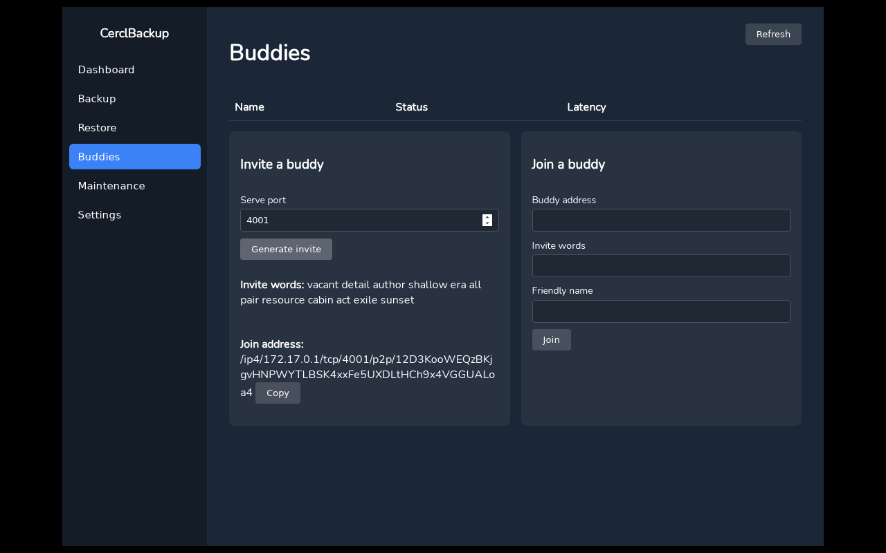
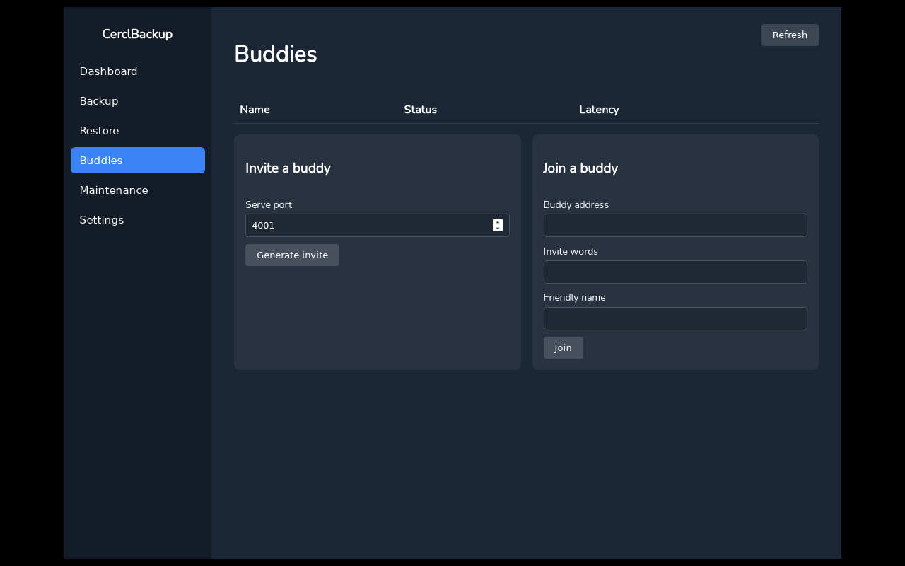
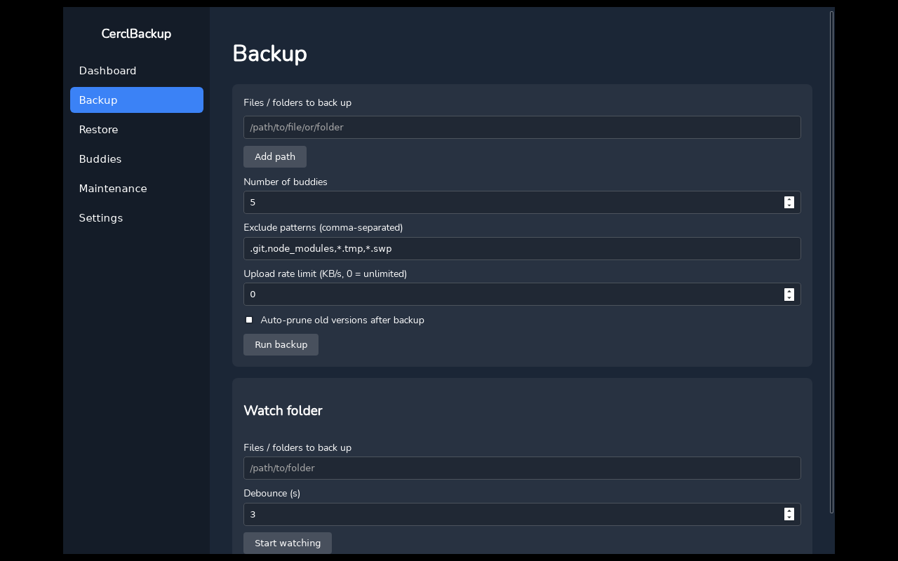
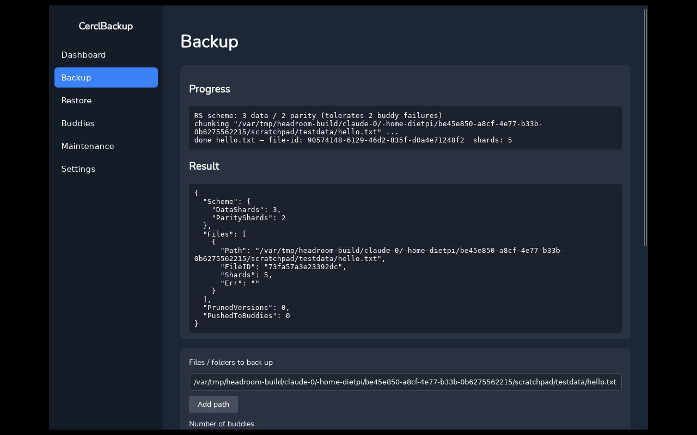
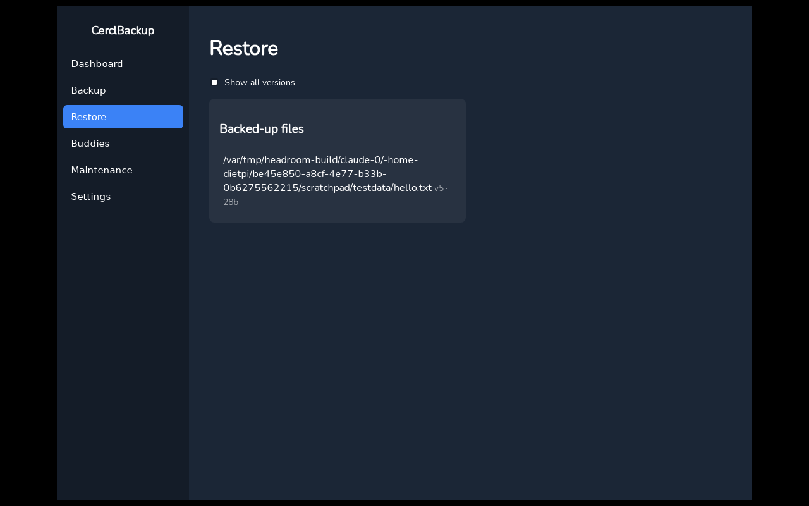
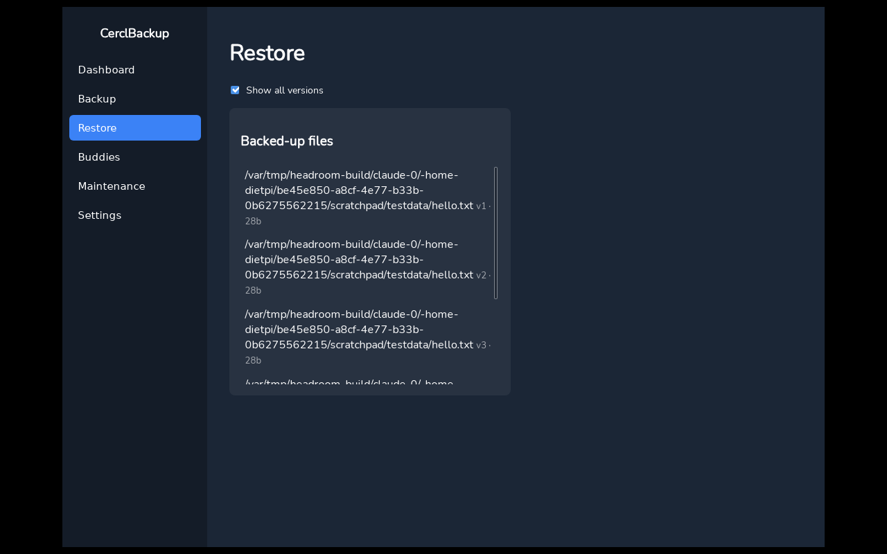
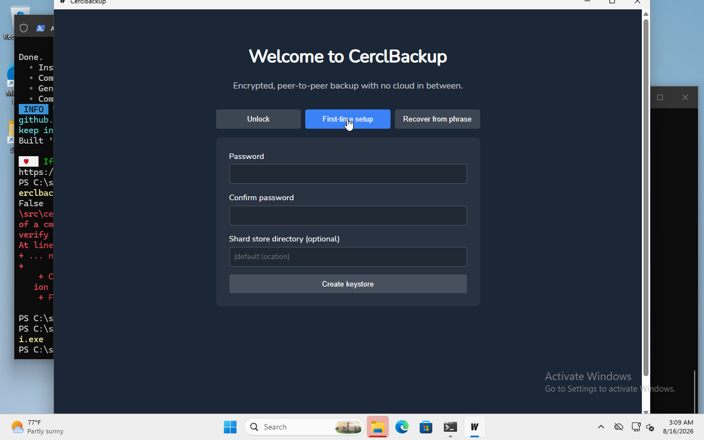

# Runbook: 3-Buddy Backup/Restore Exchange

Goal: verify that a fresh `init` → `invite`/`join` → `backup` → `restore`
round trip actually works between independent CerclBackup instances,
across the CLI and the GUI, and that shards are delivered to buddies
**live** (not silently queued for later mDNS/DHT discovery).

This exercised the fix in [`internal/p2p`, `internal/api`, `internal/buddy`
and `pkg/wire`](../../internal/p2p/handler.go) where a freshly-joined buddy's
address is now self-reported during the invite handshake, so the inviter
can push shards to it immediately instead of depending on local-network
discovery (which most real internet-based buddy pairs — home NAT routers —
never complete).

## 1. CLI: 4-node pairing, backup, restore

Four independent identities (A, B, C, D) were run as separate `serve`
daemons, each with its own `HOME`/config dir and libp2p port:

```
$ cerclbackup serve --password nodeA-pass123 --port 17421 --health-addr 127.0.0.1:17431
$ cerclbackup serve --password nodeB-pass456 --port 17422 --health-addr 127.0.0.1:17432
$ cerclbackup serve --password nodeC-pass789 --port 17423 --health-addr 127.0.0.1:17433
$ cerclbackup serve --password nodeD-passabc --port 17424 --health-addr 127.0.0.1:17434
```

A generates one invite per buddy, and B/C/D each join, self-reporting their
own `serve` port with `--port`:

```
$ cerclbackup invite --password nodeA-pass123 --port 17421
...
cerclbackup join --addr /ip4/127.0.0.1/tcp/17421/p2p/12D3KooWBrCM... \
  --words "record scrap swarm elephant eye cover spot name common dial guard fix" \
  --password <their-pw>

$ cerclbackup join --addr /ip4/127.0.0.1/tcp/17421/p2p/12D3KooWBrCM... \
    --words "client involve expose slide purity one garage feature wonder sun scorpion sunny" \
    --password nodeB-pass456 --name PeerB --port 17422
Paired with buddy 12D3KooWBrCMkTtQ8hkQCZo33hk9L32fxF4dKETnnq7brY4gETRM
```

(repeated for C and D). A's buddy list now shows all three with correct
friendly names:

```
$ cerclbackup buddy list --password nodeA-pass123
Friendly Name         Peer ID
-------------         -------
PeerC                 12D3KooWHw6xQ5Xjt1zqABJSq1Tg9dVf1UiHhSiQhg39E2ibs3ru
PeerD                 12D3KooWG1iRNFJfFXNbsfyMVZ1bm1oCSigk5iJQeCyNwgERrNzE
PeerB                 12D3KooWJu9jncAxd93iuyo5ZiTHkxSX63pPxp5oT4C3FDPEkZKR
```

A backs up a file and shards go out to all three buddies immediately:

```
$ cerclbackup backup --src /tmp/testfile_A.txt --password nodeA-pass123 --buddies 3
[backup] RS scheme: 2 data / 1 parity (tolerates 1 buddy failures)
[backup] chunking "/tmp/testfile_A.txt" ...
[backup] done testfile_A.txt — file-id: d6d9d030-... shards: 3
[backup] pushed 3/3 shards to buddy 12D3KooWHw6x...
[backup] pushed 3/3 shards to buddy 12D3KooWG1iR...
[backup] pushed 3/3 shards to buddy 12D3KooWJu9j...
```

Shard files land on disk on B/C/D under
`~/.config/cerclbackup/shards/remote/<A's peer ID>/...` at the moment
`backup` runs — confirmed by listing each buddy's store directory right
after the command returned, with no delay.

Restore on A reconnects to the buddies and reconstructs the file
byte-for-byte:

```
$ cerclbackup restore --file /tmp/testfile_A.txt --out /tmp/restored_A.txt --password nodeA-pass123
[restore] using latest version 1 (backed 2026-08-16 16:00:06)
[restore] restoring "/tmp/testfile_A.txt" (76 bytes, scheme 2/1) ...
[restore] P2P host ready, connected to 3 buddy addr(s)
[restore] integrity check passed
[restore] restored to "/tmp/restored_A.txt"

$ diff /tmp/testfile_A.txt /tmp/restored_A.txt && echo "RESTORE MATCHES ORIGINAL"
RESTORE MATCHES ORIGINAL
```

## 2. Linux GUI: buddy pairing

Buddies tab — generating an invite and the (empty, pre-pairing) buddy list:




## 3. Linux GUI: backup

Backup form, then the result after running a backup (RS scheme, shard
count, per-file result JSON):




## 4. Linux GUI: restore

Restore tab showing the backed-up file, and with "show all versions"
toggled on to see version history:




## 5. Windows GUI: first-run setup

The Windows build (`wails build`) launches and completes first-time
keystore setup:



**Not yet verified**: a live buddy pairing between the Windows GUI instance
and the Linux instances above — that requires the Windows VM and this
Linux container to actually reach each other over the network, which
wasn't set up in this pass. The Windows leg here only confirms the GUI
builds, launches, and completes keystore setup on Windows; the P2P
invite/join code path is identical to the CLI/Linux-GUI path already
verified end-to-end in sections 1–4, and unit tests
(`internal/p2p/p2p_test.go`) cover the same handshake with fake in-process
peers.

## Bug found and fixed during this exercise

Before the fix, `backup` right after a fresh pairing queued shards as
"unreachable" instead of delivering them, because the inviter never
learned a dialable address for the buddy that just joined — it depended
entirely on mDNS/DHT discovery, which doesn't complete on most real
internet-connected home networks. The joiner now self-reports its address
during the invite handshake, so the very first backup after pairing
delivers shards immediately (see section 1 above, and
`internal/p2p/handler.go`).
